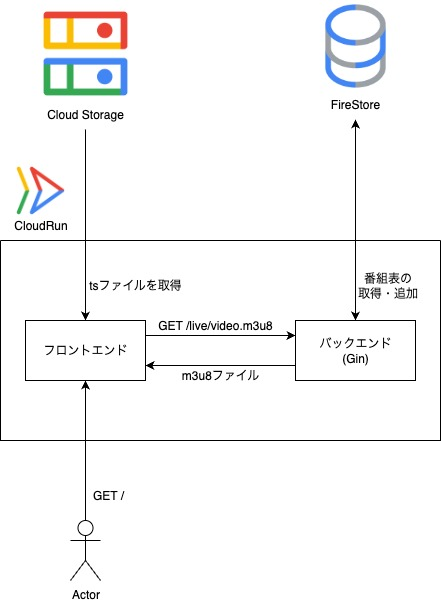

# HLS Streaming Server

HLS（HTTP Live Streaming）を使用したライブストリーミングサーバーです。Google Cloud Firestore、Google Cloud Storage（GCS）と連携して、スケジュールに基づいた動画配信を行います。Clean Architectureの設計原則に基づいて構築され、プロダクション対応のアプリケーションです。

## 特徴

- HLS形式での動画ストリーミング配信
- Google Cloud Firestoreを使用したスケジュール管理
- Google Cloud Storageからの動画ファイル配信
- 署名付きURL（3分有効期限）によるセキュアなファイルアクセス
- リアルタイムでの番組切り替え（番組間の継続性保証）
- 静的画像表示（番組間の待機時間）
- WebベースのHLSプレイヤー
- Clean Architecture設計による高い保守性
- VOD（Video On Demand）対応
- API経由での番組追加機能
- 動画ファイルアップロードと自動HLS変換機能

## アーキテクチャ

### 設計原則
- **Clean Architecture**: レイヤー分離による高い保守性と拡張性
- **Domain-Driven Design (DDD)**: ビジネスロジックの中央集権化
- **Dependency Injection**: 疎結合設計による高いテスタビリティ
- **Repository Pattern**: データアクセス層の抽象化
- **Interface Segregation**: 適切な抽象化による依存関係の制御

### ディレクトリ構成

```
hls-streaming/                       # プロジェクトルート
├── cmd/                             # アプリケーションエントリーポイント
│   └── server/
│       └── main.go                  # 依存性注入・サーバー起動・設定初期化
├── internal/                        # プライベートアプリケーションコード
│   ├── domain/                      # ⭐ ドメインレイヤー（ビジネスロジック中核）
│   │   ├── schedule.go              # 番組スケジュール・時間計算・検索ロジック
│   │   └── playlist.go              # M3U8解析・セグメント管理・HLS仕様対応
│   ├── repository/                  # 📊 データアクセス層（インフラ抽象化）
│   │   ├── firestore.go             # Firestore番組データ取得・ソート処理
│   │   └── gcs.go                   # GCSファイル操作・署名付きURL・ダウンロード
│   ├── service/                     # 🔧 アプリケーションサービス層（ビジネスフロー）
│   │   ├── schedule.go              # 番組管理・定期更新・並行処理・状態管理
│   │   ├── streaming.go             # ストリーミング・プレイリスト生成・切り替え制御
│   │   └── media.go                 # メディア処理・動画アップロード・HLS変換統合
│   ├── handler/                     # 🌐 プレゼンテーション層（HTTP境界）
│   │   └── http.go                  # RESTエンドポイント・ルーティング・JSON変換
│   └── media/                       # 🎬 メディア処理層（外部ツール連携）
│       └── ffmpeg.go                # FFmpegラッパー・HLS変換・エンコーディング
├── pkg/                             # 再利用可能パブリックライブラリ
│   └── config/
│       └── config.go                # 環境変数管理・設定検証・デフォルト値
├── test/                            # 🧪 テストスイート（品質保証）
│   ├── domain_test.go               # ドメインロジック単体テスト・ビジネスルール検証
│   ├── repository_test.go           # データアクセス統合テスト・外部連携
│   └── media_test.go                # メディア処理テスト・FFmpeg動作確認
├── credentials/                     # 🔐 認証情報（Git管理対象外推奨）
├── docker-compose.yaml             # 🐳 開発環境構築・サービス連携定義
├── dockerfile                       # 📦 本番イメージ・マルチステージビルド
├── gcs_cors_setting.json           # 🌍 クロスオリジン設定・セキュリティポリシー
└── index.html                       # 💻 デモフロントエンド・API動作確認
```

**依存関係フロー**: Handler → Service → Repository → Domain
**データフロー**: GCS/Firestore → Repository → Service → Handler → Client

### システム構成図



システム全体の構成は上図の通りです：
- **Actor（ユーザー）**: Webブラウザからアクセス
- **フロントエンド**: index.htmlによるHLSプレイヤー
- **バックエンド（Gin）**: Go製のAPIサーバー
- **Cloud Storage**: 動画ファイル（HLS形式）の保存
- **FireStore**: 番組スケジュールデータの管理
- **CloudRun**: コンテナベースのデプロイ（オプション）

## 起動に必要なこと

### 1. 環境変数の設定

プロジェクトルートに `.env` ファイルを作成し、以下の設定を記述してください：

```env
PROJECT_ID=your-google-cloud-project-id
BUCKET=your-gcs-bucket-name
PORT=8080
```

### 2. Google Cloud の設定

#### Google Cloud Firestore
1. Google Cloud Projectを作成
2. Firestoreを有効化
3. サービスアカウントキーを作成し、`credentials/` ディレクトリに配置
4. 環境変数 `GOOGLE_APPLICATION_CREDENTIALS` を設定（オプション）

#### Google Cloud Storage
1. GCSバケットを作成
2. 動画ファイルをバケットにアップロード（日付/番組名の階層構造）
3. CORS設定を適用
4. サービスアカウントにStorage Object Viewerロールを付与

### 3. Firestoreデータ構造

`schedules` コレクションに以下の形式でドキュメントを作成してください：

```json
{
  "programs": [
    {
      "start_time": "2025-08-25T09:00:00+09:00",
      "duration_sec": 1800,
      "type": "video",
      "path_template": "handgesture",
      "title": "手話動画"
    },
    {
      "start_time": "2025-08-25T10:00:00+09:00", 
      "duration_sec": 1200,
      "type": "video",
      "path_template": "minecraft",
      "title": "Minecraft動画"
    }
  ]
}
```

ドキュメントIDは日付形式（例：`2025-08-25`）で作成してください。

### 4. 動画ファイルの準備

HLS形式の動画ファイルをGoogle Cloud Storageバケットに以下の階層構造でアップロードしてください：

```
your-bucket/
├── 2025-09-09/              # 日付ディレクトリ
│   ├── 番組名1/
│   │   ├── video.m3u8       # HLSプレイリストファイル
│   │   ├── video000.ts      # 動画セグメントファイル
│   │   ├── video001.ts
│   │   └── ...
│   └── 番組名2/
│       ├── video.m3u8
│       ├── video000.ts
│       └── ...
└── 2025-09-10/
    └── ...
```

各動画フォルダには以下のファイルが必要です：
- `video.m3u8` - HLSプレイリストファイル
- `video000.ts`, `video001.ts`, ... - 動画セグメントファイル

## 起動方法

Docker Composeを使用してアプリケーションを起動します：

```bash
# プロジェクトディレクトリに移動
cd hls-streaming

# コンテナの起動
docker-compose up -d

# ログの確認
docker-compose logs -f

# コンテナの停止
docker-compose down
```

**補足**:
- 初回起動時は依存関係のダウンロードとビルドに時間がかかります
- アプリケーションは自動的にポート8080で起動します
- 環境変数は `.env` ファイルから自動的に読み込まれます

## アクセス方法

アプリケーション起動後、以下のURLにアクセスしてください：

- **Webプレイヤー**: http://localhost:8080
- **HLSプレイリスト**: http://localhost:8080/live/video.m3u8
- **ストリーム状態確認**: http://localhost:8080/live/status

## API エンドポイント

| メソッド | エンドポイント | 説明 | レスポンス |
|---------|---------------|------|-----------|
| GET | `/` | フロントエンドUI配信 | HTML |
| GET | `/live/video.m3u8` | ライブストリーミングプレイリスト | M3U8 |
| HEAD | `/live/status` | ストリーム状態確認 | 200/204 |
| POST | `/api/refresh-schedule` | 番組表手動更新 | JSON |
| GET | `/api/schedule` | 現在の番組表取得 | JSON |
| POST | `/api/schedule?date=YYYY-MM-DD` | 番組追加 | JSON |
| POST | `/api/upload-video` | 動画ファイルアップロード・HLS変換 | JSON |
| GET | `/static/*` | 静的ファイル配信 | File |

### 番組追加APIの使用例

```bash
curl -X POST "http://localhost:8080/api/schedule?date=2025-09-09" \
  -H "Content-Type: application/json" \
  -d '{
    "start_time": "2025-09-09T15:00:00+09:00",
    "duration_sec": 1800,
    "type": "video",
    "path_template": "example-program",
    "title": "サンプル番組"
  }'
```

### 動画アップロードAPIの使用例

動画ファイル（MP4形式）をアップロードし、自動的にHLS形式に変換してGCSに保存します：

```bash
curl -X POST "http://localhost:8080/api/upload-video" \
  -F "video=@/path/to/your/video.mp4" \
  -F "date=2025-09-09" \
  -F "program_name=example-program"
```

**パラメータ**:
- `video`: アップロードする動画ファイル（MP4形式推奨、最大100MB）
- `date`: 配信日（YYYY-MM-DD形式）
- `program_name`: 番組名（英数字・ハイフン推奨）

**処理フロー**:
1. MP4動画ファイルを受信
2. FFmpegでHLS形式（M3U8 + TSセグメント）に変換
3. 変換されたファイルをGCSの `{date}/{program_name}/` に自動アップロード
4. 番組スケジュールに手動で追加する必要があります

### 動作仕様

- セグメント長: 3秒（定数）
- プレイリスト長: 15セグメント
- スケジュールはFirestoreから5分間隔で自動更新
- 番組間の待機時間は静的画像を表示
- 署名付きURL有効期限: 3分
- 番組切り替え時の継続性保証（EXT-X-DISCONTINUITY使用）

## 技術スタック

### バックエンド
- **Go 1.25.0**: メインプログラミング言語
- **Gin**: HTTPウェブフレームワーク
- **Google Cloud SDK**: GCS・Firestore連携

### 主要ライブラリ
- `cloud.google.com/go/firestore` - Firestore操作
- `cloud.google.com/go/storage` - Google Cloud Storage操作
- `github.com/gin-gonic/gin` - HTTPフレームワーク
- `github.com/joho/godotenv` - 環境変数管理

### インフラストラクチャ
- **Google Cloud Storage**: メディアファイルストレージ
- **Firestore**: 番組スケジュールデータベース
- **FFmpeg**: メディア変換エンジン（optional）
- **Docker**: コンテナ化デプロイ

### 開発・テスト
- **Go Testing**: 単体テスト・統合テスト
- **Go Modules**: 依存関係管理

## 主要機能

### 1. HLSストリーミング配信
- リアルタイム番組スケジュール管理
- M3U8プレイリスト動的生成
- セグメント署名付きURL生成
- 番組切り替え時の継続性保証

### 2. 番組スケジュール管理
- Firestoreベース番組データ管理
- 自動スケジュール更新（5分間隔）
- スレッドセーフなスケジュールアクセス
- タイムゾーン対応（JST）

### 3. クラウド統合
- Google Cloud Storage連携
- Firestore番組データベース
- 署名付きURL（3分有効期限）

### 4. メディア処理
- MP4からHLS形式への自動変換
- 動画ファイルアップロード機能
- セグメント分割（2秒単位）
- GCSへの自動アップロード

### 5. API機能
- 番組表取得・更新
- 番組追加
- 動画アップロード・変換
- ストリーム状態確認

